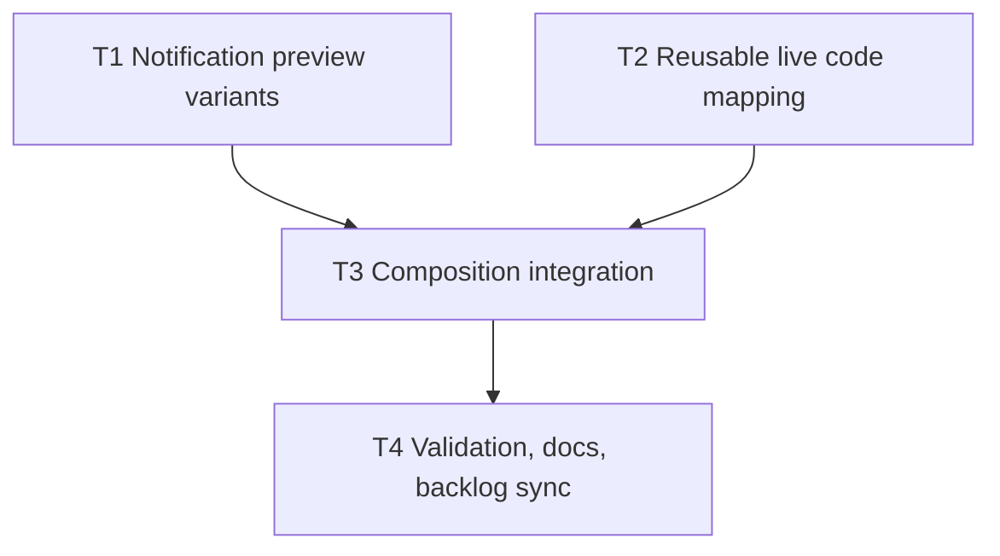

# Plan: Mock Notification Preview System

**Status:** Complete

## Initial Situation

GitHub epic #12 asks for fake stage UI notification previews that demonstrate structural variation without importing the production app. Story #13 requires variants for follow request, post like, DM request, photo tag, moderation, and post comment where used. Story #14 requires code examples to drive meaningful right-panel preview states.

The current branch starts from `origin/main`. It already contains a dark JavaScript Remotion visual-system proof and shared stage primitives, but `remotion-presentation/src/components/remocn/live-code-compilation.tsx` is still a hardcoded button demo. There is no `MockNotificationPreview`, no notification variant data model, no reusable code event API, and `remotion-presentation/src/Composition.tsx` only renders the previous three-segment visual-system sample.

## Issue

The talk content explains that notifications share a surface but have different structural rules. Without a mocked preview system, the right panel cannot show that distinction at stage distance. Without code-to-preview mapping, the audience sees code snippets as static text rather than as public API shapes with visible UI consequences.

## Solution Shape

Build a small Remotion-native notification preview system:

- typed mock notification variants for follow request, post like, DM request, photo tag, moderation, and post comment;
- shadcn-style preview components using the existing dark JavaScript stage tokens;
- a reusable `LiveCodeCompilation` API that accepts code events and a preview renderer;
- notification-focused composition segments where code examples map to meaningful preview states;
- CLI validation plus agent-browser validation of the live Remotion Studio.

The preview is conceptual stage UI. It should reveal actor/avatar versus system icon, body, context preview, media, actions, and date, while avoiding production data, routing, and app dependencies.

## Resolved Decision Ledger

| Decision                      | Resolution                                                                                | Reason                                                                                |
| ----------------------------- | ----------------------------------------------------------------------------------------- | ------------------------------------------------------------------------------------- |
| Spec approval                 | Approved for execution in this run.                                                       | User requested full create-spec -> create-plan -> implement-spec flow.                |
| Execution mode                | Full parallel mode.                                                                       | User explicitly requested full parallel with subagents.                               |
| Primary domain                | `presentation`.                                                                           | Work belongs to the Remotion keynote surface.                                         |
| Preview fidelity              | Fake conceptual stage UI.                                                                 | GitHub #12 and grill docs forbid production imports and prioritize stage readability. |
| Variant coverage              | Six variants: follow request, post like, DM request, photo tag, moderation, post comment. | Required by #13 and content docs.                                                     |
| Code mapping                  | Only shape-change slides drive preview updates.                                           | Required by #14.                                                                      |
| Remotion implementation rules | Frame-driven animation, no CSS transitions for rendered motion.                           | Required by Remotion best-practices guidance.                                         |

## Assumptions And Constraints

- The new composition may replace the current visual-system proof as the main Remotion sample for this epic, while preserving shared stage primitives and 1920x1080/60fps metadata.
- Browser validation can use local Remotion Studio and `agent-browser`.
- Existing `bun run lint` may expose pre-existing config/tooling warnings; record exact blockers instead of over-claiming.
- No product-facing GitHub issue body rewrites are needed; completion can be synced through comments and closing issues.

## Codebase Findings

- `remotion-presentation/src/components/remocn/live-code-compilation.tsx` hardcodes button code events and a button preview.
- `remotion-presentation/src/components/stage/primitives.tsx` exports `NarrativeStage`, `CodeOnlyStage`, and `CodePlusDxStage`; the notification implementation can reuse stage tokens but will need richer right-panel rendering.
- `remotion-presentation/src/components/stage/code.tsx` has a static `StageCodeBlock` suitable for narrative/code slides.
- Grill docs identify `src/components/preview/` as the expected home for preview components.
- `remotion-presentation/src/Composition.tsx` owns the current rendered sequence and exports the Remotion duration/fps/dimensions.
- `remotion-presentation/package.json` exposes `bun run build` and `bun run lint`.
- GitHub issue comments mention partial groundwork from another branch, but that groundwork is absent on `origin/main`; this plan treats it as work to implement.

## Research Used

- GitHub issues #12, #13, and #14 supplied the backlog contract.
- `slides-content.md`, `deck-beats.md`, and `fragments.md` supplied the talk shapes, code snippets, and stress-test moments.
- Grill docs supplied fake UI, shadcn-style panel, Remocn, 1920x1080, and stage-readability constraints.
- Remotion best-practices rules supplied frame-driven animation, sequencing, and composition metadata guidance.

## Required Inner Phases

### Grill Phase

No user question is required. The issue bodies and content docs resolve every plan-shaping branch:

- fake conceptual preview UI, not production app UI;
- six notification shapes;
- code mapping only on shape-change slides;
- Remotion 1920x1080/60fps presentation validation;
- full parallel execution.

### Parallel Research Phase

Used. Two readonly sidecar agents were launched:

- one to inspect Remotion implementation, scripts, component APIs, and risks;
- one to extract content requirements from slide docs and grill docs.

Main-thread discovery also confirmed the absence of current preview groundwork on `origin/main`.

### Swarm Planner Phase

The task graph below uses disjoint write scopes for Wave 1 and integration/finalization waves after dependencies are satisfied.

### TDD Phase

There is no dedicated test harness. Every task still has a RED target through a public behavior check: missing exports, missing reusable props, missing composition states, or missing completion metadata first; then CLI/browser validation after implementation.

## Dependency Graph

## Parallel Execution Waves

### Wave 1

- T1 and T2 ran in parallel with disjoint write scopes.

### Wave 2

- T3 integrated T1 and T2 into the Remotion composition.

### Wave 3

- T4 validated the branch, finalized docs, and prepared GitHub backlog sync.

## Tasks

### T1: Build mock notification preview variants

- **depends_on**: []
- **location**: `remotion-presentation/src/components/preview/**`
- **description**: Create typed fake notification variant data and a stage-readable `MockNotificationPreview` component. Cover follow request, post like, DM request, photo tag, moderation, and post comment. Use existing stage tokens for shadcn-style cards, avatars, badges, buttons, separators, media thumbnails, and panels.
- **validation**: Public imports expose the variant ids and preview component; all six variant ids are present; a focused render/import check can instantiate the preview without production app imports.
- **status**: Complete
- **log**:
- RED: `src/components/preview` did not exist and no public notification preview exports were present.
- GREEN: Added typed fake data and `MockNotificationPreview` for follow request, post like, DM request, photo tag, moderation, and post comment.
- Parent review tightened fixture labels so actions match the talk shapes: follow back, accept/ignore, view/remove tag, view decision/appeal, and reply.
- Focused `bunx eslint src/components/preview src/components/remocn/live-code-compilation.tsx` passed before the full TypeScript step hit the existing `oxlint.config.ts` blocker.
- **files edited/created**:
- `remotion-presentation/src/components/preview/notification-preview-data.ts`
- `remotion-presentation/src/components/preview/MockNotificationPreview.tsx`
- `remotion-presentation/src/components/preview/index.ts`
- **backlog_item_id**: #13
- **backlog_item_url**: https://github.com/stefan-garofalo/torinojs-composition/issues/13
- **relation_mode**: body-links
- **assigned_skills**: [`agent-browser`, `async-react-patterns`, `design-taste-frontend`, `frontend-domain-structure`, `quality-types`, `vercel-composition-patterns`, `vercel-react-best-practices`, `tdd`, `simplify`, `remotion:remotion-best-practices`]
- **tdd_target**: First prove no public notification preview exports or six-variant coverage exist, then add typed exports and a renderable preview component.
- **review_mode**: mixed

### T2: Make live code compilation reusable for preview state mapping

- **depends_on**: []
- **location**: `remotion-presentation/src/components/remocn/live-code-compilation.tsx`
- **description**: Generalize `LiveCodeCompilation` so callers can pass code events and a `renderPreview` callback while preserving the existing button demo as defaults. Event state must advance from Remotion frames and avoid CSS animation/transition dependencies.
- **validation**: TypeScript accepts custom code events and a custom preview renderer; existing default behavior still has a fallback path; the component exposes no notification-specific production dependency.
- **status**: Complete
- **log**:
- RED: `LiveCodeCompilation` had hardcoded button events and did not accept `codeEvents` or `renderPreview`.
- GREEN: Added exported generic live-code event/render types, `codeEvents`, `renderPreview`, and default button compatibility.
- Focused `npx eslint src/components/remocn/live-code-compilation.tsx` passed in the worker; parent focused ESLint also passed before the full TypeScript step hit the existing `oxlint.config.ts` blocker.
- **files edited/created**:
- `remotion-presentation/src/components/remocn/live-code-compilation.tsx`
- **backlog_item_id**: #14
- **backlog_item_url**: https://github.com/stefan-garofalo/torinojs-composition/issues/14
- **relation_mode**: body-links
- **assigned_skills**: [`agent-browser`, `async-react-patterns`, `design-taste-frontend`, `frontend-domain-structure`, `quality-types`, `vercel-composition-patterns`, `vercel-react-best-practices`, `tdd`, `simplify`, `remotion:remotion-best-practices`]
- **tdd_target**: First prove `LiveCodeCompilation` does not accept `codeEvents` or `renderPreview`, then add that public API with default compatibility.
- **review_mode**: cli

### T3: Integrate notification code-plus-preview slides

- **depends_on**: [T1, T2]
- **location**: `remotion-presentation/src/Composition.tsx`
- **description**: Replace the visual-system-only sample with notification-focused segments that map talk snippets to preview states: existing DM/four-shape baseline, moderation generic props, export-list/supported-shapes relief, moderation named abstraction, and post-comment new behavior/new place. Preview should update only on these meaningful shape-change segments.
- **validation**: Composition metadata remains 1920x1080/60fps; rendered content includes all six variants and code-driven preview state changes; Remotion still render or build succeeds.
- **status**: Complete
- **log**:
- RED: Existing composition had only the prior visual-system sample and no notification preview states.
- GREEN: Added a six-variant overview and five code-plus-preview scenes covering baseline generic props, moderation generic props, supported-shape exports, named moderation composition, and post-comment new behavior.
- Parent review removed demo-era `Preview HMR` stage text, added a code title prop, and increased live-code readability.
- `bunx eslint src/Composition.tsx src/components/preview src/components/remocn/live-code-compilation.tsx` passed.
- `bun run build` passed with a Remotion warning about installed `zod` 4.4.3 versus requested 4.3.6.
- Representative stills rendered: `/tmp/gh12-overview.png`, `/tmp/gh12-moderation.png`, `/tmp/gh12-post-comment.png`.
- `agent-browser` opened Remotion Studio at `http://localhost:3012/MyComp`; snapshot confirmed all six variant headings on the overview frame and screenshot saved to `/tmp/gh12-agent-browser-overview.png`.
- **files edited/created**:
- `remotion-presentation/src/Composition.tsx`
- `remotion-presentation/src/components/remocn/live-code-compilation.tsx`
- **backlog_item_id**: #14
- **backlog_item_url**: https://github.com/stefan-garofalo/torinojs-composition/issues/14
- **relation_mode**: body-links
- **assigned_skills**: [`agent-browser`, `async-react-patterns`, `design-taste-frontend`, `frontend-domain-structure`, `quality-types`, `vercel-composition-patterns`, `vercel-react-best-practices`, `tdd`, `simplify`, `remotion:remotion-best-practices`]
- **tdd_target**: First prove the composition contains no notification preview states, then render notification segments that expose all story-required mapping moments.
- **review_mode**: mixed

### T4: Validate, finalize docs, PR, merge, and close backlog

- **depends_on**: [T3]
- **location**: `wiki/specs/presentation/GH-12-mock-notification-preview-system/**`, `wiki/index.md`, `wiki/specs/presentation/presentation-specs.md`, `wiki/log.md`, GitHub issues #12/#13/#14
- **description**: Run CLI validation and browser presentation validation. Update `SPEC.md`, `PLAN.md`, `IMPLEMENTATION-NOTES.md`, wiki index/spec map/log, and GitHub backlog comments/state. Create a PR, merge it with rebase onto main, and close the issues if validation passes.
- **validation**: Spec status is `implemented`; plan status is complete; implementation notes include execution mode, sanity checks, acceptance audit, and manual review checklist; PR is created and rebase-merged; issues #12/#13/#14 are closed.
- **status**: Complete
- **log**:
- Final docs and GitHub sync are parent-owned after implementation validation.
- Parent review caught overview clipping; fixed by shrinking and reflowing the six-variant overview grid before final validation.
- T4 docs are marked complete for the branch artifact; PR merge and issue closure are performed after this commit with native GitHub state.
- **files edited/created**:
- `wiki/specs/presentation/GH-12-mock-notification-preview-system/SPEC.md`
- `wiki/specs/presentation/GH-12-mock-notification-preview-system/PLAN.md`
- `wiki/specs/presentation/GH-12-mock-notification-preview-system/IMPLEMENTATION-NOTES.md`
- `wiki/index.md`
- `wiki/specs/presentation/presentation-specs.md`
- `wiki/log.md`
- **backlog_item_id**: #12
- **backlog_item_url**: https://github.com/stefan-garofalo/torinojs-composition/issues/12
- **relation_mode**: body-links
- **assigned_skills**: [`create-spec`, `create-plan`, `implement-spec`, `write-backlog`, `simplify`, `tdd`, `agent-browser`]
- **tdd_target**: First prove implementation metadata/backlog completion is absent, then update docs and tracker state only after validation evidence exists.
- **review_mode**: mixed

## Testing Strategy

- Run import checks for notification variants and `LiveCodeCompilation` public props.
- Run `cd remotion-presentation && bun run build`.
- Run `cd remotion-presentation && bun run lint` and record exact blockers if unrelated tooling fails.
- Render still frames for representative notification segments.
- Start Remotion Studio and use `agent-browser` to inspect the presentation surface.

## Risks And Mitigations

| Risk                                                  | Mitigation                                                                                                     |
| ----------------------------------------------------- | -------------------------------------------------------------------------------------------------------------- |
| Parallel workers conflict in shared composition code. | Keep T1/T2 disjoint in Wave 1; T3 integrates after both complete.                                              |
| Preview becomes too production-faithful.              | Use fixed fake data, no app imports, no routes, and stage-readable labels/actions.                             |
| Code animation becomes non-deterministic.             | Use Remotion frame math and explicit event timelines.                                                          |
| Text or UI becomes unreadable at stage distance.      | Validate still frames and browser view at 1920x1080.                                                           |
| Existing lint/tooling blockers appear.                | Record exact blockers and rely on build/still/browser evidence for app validation when blockers are unrelated. |

## Validation Gates

### Gate 1: Wave 1 Complete

- T1 exports six mock variants and a preview component.
- T2 exposes reusable code event and preview renderer props.
- No production app imports exist.

### Gate 2: Wave 2 Complete

- Composition renders notification code-plus-preview segments.
- All six shapes appear somewhere in the presentation.
- Preview changes only on meaningful shape-change segments.

### Gate 3: Wave 3 Complete

- CLI validation and browser validation are complete or exact blockers are recorded.
- Acceptance audit and manual review checklist are written.
- PR is merged by rebase onto main.
- Issues #12, #13, and #14 are closed.

## Unresolved Questions

None. The GitHub issues, content docs, and grill docs resolve every plan-shaping branch needed for this epic.
