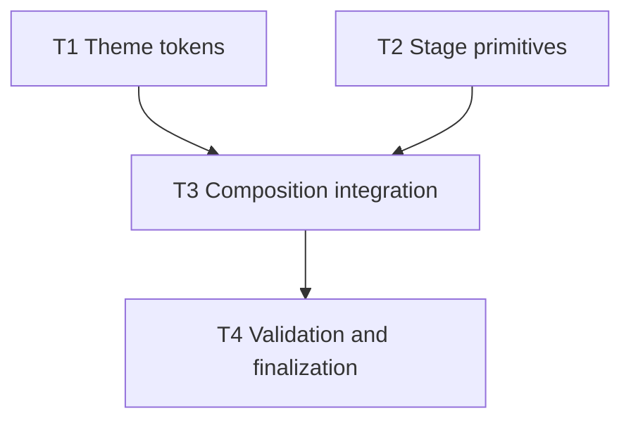

# Plan: Dark JavaScript Visual System

**Status:** Complete

## Initial Situation

The Remotion keynote app is scaffolded but not yet visually implemented. `remotion-presentation/src/Composition.tsx` returns `null`, while `Root.tsx` still defines a 1280x720, 30fps, 60-frame placeholder composition. Existing Remocn components provide dark code and transition primitives, but there is no shared JavaScript theme token file, no shared stage layout rhythm, and no 1920x1080 sample surface proving the dark JavaScript system.

GitHub epic #9 asks for a dark JavaScript visual system. Story #10 requires exact JavaScript-yellow and dark-grey tokens plus shadcn-style defaults. Story #11 requires consistent narrative, code-only, and code-plus-DX-panel stage rhythm with 1920x1080 readability.

## Issue

The deck needs a darkmode-first visual baseline before slide content can scale. Without shared tokens and layout primitives, every slide would invent spacing, surface color, code contrast, and UI proportions independently.

## Solution Shape

Create a small Remotion-native visual system:

- shared stage tokens for JavaScript yellow `#F0DB4F`, dark base `#323330`, neutral surfaces, radius, spacing, fonts, and motion constants;
- stage layout primitives for narrative, code-only, and code-plus-DX-panel slide families;
- a focused sample composition that renders all three families at 1920x1080 and 60fps;
- validation through TypeScript/lint and Remotion bundling.

Use shadcn-style conventions through source-owned tokens and primitives, not a bespoke component framework. The project already has `components.json` configured for `new-york`, neutral base, Tailwind v4 CSS variables, and Remocn registry entries. Official shadcn docs confirm CSS variables are the recommended theming mechanism, Tailwind v4 projects use `@theme inline`, and `new-york` is the default style for new projects.

## Resolved Decision Ledger

| Decision | Resolution | Reason |
|----------|------------|--------|
| Spec approval | Approved for execution in this run. | User explicitly requested create-spec -> create-plan -> implement-spec in one objective. |
| Execution mode | Full parallel mode. | User explicitly required `implement-spec` in full parallel mode. |
| Primary domain | `presentation`. | Scope is the Remotion keynote stage surface. |
| Theme tokens | `#F0DB4F` yellow/corn and `#323330` dark grey/black wool. | Required by GitHub #10 and grill status. |
| Visual style | Darkmode-first, shadcn-style neutral surfaces and proportions. | Required by GitHub #9/#10 and grill status. |
| Presentation target | 1920x1080, 60fps. | Required by grill status and stage readability. |
| Transition grammar | No decorative slide-level transition effects by default. | Explicit non-goal in GitHub #11. |

## Assumptions And Constraints

- The visual-system proof can be a focused sample stage composition rather than all sixteen talk slides.
- The sample must show narrative, code-only, and code-plus-DX-panel families so story #11 is materially covered.
- Existing Remocn components can be reused where they support readability.
- No visible presenter UI, cue labels, counters, or debug overlays should appear.
- Do not rewrite human-authored `slides-content.md`, `deck-beats.md`, or `fragments.md`.
- Keep implementation debt out of TODOs; resolve in-goal issues during this run.

## Codebase Findings

- `remotion-presentation/src/Composition.tsx` is empty and is the main composition assembly target.
- `remotion-presentation/src/Root.tsx` must be updated from placeholder metadata to 1920x1080 at 60fps.
- `remotion-presentation/src/index.css` imports Tailwind only; it can host CSS variables for the shadcn-style theme.
- Existing Remocn components are inline-style heavy and already dark/code oriented.
- `remotion-presentation/package.json` exposes `bun run lint` (`eslint src && tsc`) and `bun run build` (`remotion bundle`).

## External Research Used

- `vercel:shadcn` skill: shadcn/ui is source-owned component code, with non-interactive CLI guidance and Tailwind v4 notes.
- Official shadcn theming docs: CSS variables are the recommended theming surface.
- Official shadcn Tailwind v4 docs: Tailwind v4 uses `@theme inline`, and new projects use `new-york`.
- Official `components.json` docs: Tailwind v4 config path should be blank and `baseColor: neutral` is valid.

## Required Inner Phases

### Grill Phase

No user question is required. All plan-shaping decisions for this epic are already locked by the GitHub issue bodies and grill docs:

- darkmode-first Remotion keynote;
- exact JS yellow and dark base tokens;
- shadcn-style typography, spacing, radius, cards, buttons, and UI proportions;
- 1920x1080 readability;
- no literal PPT template recreation;
- implementation in full parallel mode.

### Parallel Research Phase

Used. Two readonly sidecar discoveries covered independent surfaces:

- Remotion app structure, scripts, current composition metadata, existing Remocn components, and disjoint implementation write scopes.
- Wiki/grill/spec context, accepted visual-system decisions, and required bookkeeping.

### Swarm Planner Phase

The task graph below is designed for full parallel implementation. Wave 1 has disjoint setup tasks. Wave 2 integrates the visual system into the Remotion composition after the shared primitives exist. Wave 3 validates and finalizes documentation.

### TDD Phase

There is no existing test harness. Each task still has a RED target: first prove the current public behavior is missing or invalid, then make the exact public validation pass. For visual tasks, RED evidence may be an initial failing type/lint/build, placeholder metadata, or a documented non-testable visual gap paired with Remotion bundle validation and manual review instructions.

## Dependency Graph

## Parallel Execution Waves

### Wave 1

- T1 and T2 ran in parallel.

### Wave 2

- T3 ran after T1 and T2.

### Wave 3

- T4 completed after T3 for the docs-finalization scope assigned in Wave 3. GitHub issue comments and parent final validation remain parent-owned and were not edited here.

## Tasks

### T1: Define shared dark JavaScript theme tokens

- **depends_on**: []
- **location**: `remotion-presentation/src/index.css`, `remotion-presentation/src/theme/**`
- **description**: Add shared stage theme tokens for JS yellow, dark base, neutral surfaces, text, borders, radius, spacing, typography, and motion constants. Align CSS variables with shadcn/Tailwind v4 conventions without installing unnecessary UI components.
- **validation**: `#F0DB4F` and `#323330` are exported from the theme module and represented as CSS variables; TypeScript can import the token module.
- **status**: Complete
- **log**:
- T1 complete. Added shadcn/Tailwind v4-aligned dark JavaScript stage CSS variables in `remotion-presentation/src/index.css` and an importable TypeScript theme module in `remotion-presentation/src/theme/index.ts`.
- RED: `bun -e 'const theme = await import("./src/theme")...'` failed with `Cannot find module './src/theme'`; `rg "#F0DB4F|#323330|jsPalette|stageTheme" src/index.css src/theme` found no theme directory/tokens.
- GREEN: focused import check passed and printed `#F0DB4F #323330`; `bunx tsc --noEmit --strict --module commonjs --target es2018 src/theme/index.ts --pretty false` passed; token grep confirms exact CSS and TS values.
- Parent review unified stage primitive fallback tokens with the canonical theme module and verified public imports print `#F0DB4F #323330 #F0DB4F #323330 function function function`.
- Blocker: full `bun run lint` is deferred to final validation because project dependencies were not initially installed.
- **files edited/created**:
- `remotion-presentation/src/index.css`
- `remotion-presentation/src/theme/index.ts`
- **backlog_item_id**: #10
- **backlog_item_url**: https://github.com/stefan-garofalo/torinojs-composition/issues/10
- **relation_mode**: body-links
- **assigned_skills**: [`design-taste-frontend`, `frontend-domain-structure`, `quality-types`, `vercel-react-best-practices`, `vercel-composition-patterns`, `tdd`, `simplify`, `vercel:shadcn`]
- **tdd_target**: First prove the app lacks importable visual tokens and exact JS palette values, then make a public theme module expose them.
- **review_mode**: cli

### T2: Build shared stage layout primitives

- **depends_on**: []
- **location**: `remotion-presentation/src/components/stage/**`
- **description**: Create Remotion-native stage primitives for narrative, code-only, and code-plus-DX-panel slide families. Primitives must encode consistent 1920x1080-safe spacing, typography, shadcn-style surface proportions, compact card/button treatment, and high-contrast dark surfaces.
- **validation**: Primitives are importable and typed; each family has a concrete exported component or helper that can render without depending on slide-specific content.
- **status**: Complete
- **log**:
- T2 complete. Added typed stage primitives for `NarrativeStage`, `CodeOnlyStage`, `CodeDxStage`, and alias `CodePlusDxStage`.
- RED: public import from `./src/components/stage` failed with `Cannot find module './src/components/stage'`.
- GREEN: public import check passed for all three required slide families.
- Validation: focused TypeScript and ESLint checks for stage files passed; `eslint src` passed with one existing warning in `src/components/remocn/live-code-compilation.tsx`.
- Parent review connected `stageTokens` to the shared theme module so visual primitives do not carry a second source of truth for the required palette.
- **files edited/created**:
- `remotion-presentation/src/components/stage/code.tsx`
- `remotion-presentation/src/components/stage/index.ts`
- `remotion-presentation/src/components/stage/primitives.tsx`
- `remotion-presentation/src/components/stage/tokens.ts`
- **backlog_item_id**: #11
- **backlog_item_url**: https://github.com/stefan-garofalo/torinojs-composition/issues/11
- **relation_mode**: body-links
- **assigned_skills**: [`agent-browser`, `async-react-patterns`, `design-taste-frontend`, `frontend-domain-structure`, `quality-types`, `vercel-react-best-practices`, `vercel-composition-patterns`, `tdd`, `simplify`, `vercel:shadcn`]
- **tdd_target**: First prove there is no public primitive for the three required slide families, then add typed primitives that expose the families.
- **review_mode**: mixed

### T3: Assemble the visual-system sample composition

- **depends_on**: [T1, T2]
- **location**: `remotion-presentation/src/Composition.tsx`, `remotion-presentation/src/Root.tsx`
- **description**: Replace the placeholder composition with a focused visual-system sample showing narrative, code-only, and code-plus-DX-panel stages. Update Remotion metadata to 1920x1080 and 60fps. Use the shared tokens/primitives and existing Remocn code blocks where useful.
- **validation**: Remotion root declares 1920x1080 at 60fps; composition renders non-null content; sample includes all three slide families; `bun run build` succeeds or any failure is recorded with exact blocker.
- **status**: Complete
- **log**:
- T3 complete. Replaced the null placeholder with a focused three-segment visual-system sample using shared stage primitives for narrative, code-only, and code-plus-DX panel families.
- Updated public Remotion metadata to 1920x1080, 60fps, and 540 frames.
- RED: public import check showed placeholder metadata/content: `{"id":"MyComp","width":1280,"height":720,"fps":30,"durationInFrames":60,"compositionIsNull":true,"htmlLength":0}`.
- GREEN: public import/metadata check passed with `{"id":"MyComp","width":1920,"height":1080,"fps":60,"durationInFrames":540,"compositionIsNull":false}`.
- Focused TypeScript check for `Composition.tsx` and `Root.tsx` passed. Remotion still renders passed for frames 0, 180, and 360. `bun run build` passed.
- Parent visual review inspected `/tmp/t3-visual-system-frame0.png`, `/tmp/t3-visual-system-frame180.png`, and `/tmp/t3-visual-system-frame360.png`; all three required slide families render with dark surfaces and JS-yellow accents.
- Blocker: full `bun run lint` fails on pre-existing `oxlint.config.ts` ultracite module resolution/type errors outside T3 scope; ESLint itself passed with one existing Remocn non-pure-animation warning.
- **files edited/created**:
- `remotion-presentation/src/Composition.tsx`
- `remotion-presentation/src/Root.tsx`
- **backlog_item_id**: #9
- **backlog_item_url**: https://github.com/stefan-garofalo/torinojs-composition/issues/9
- **relation_mode**: body-links
- **assigned_skills**: [`agent-browser`, `async-react-patterns`, `design-taste-frontend`, `frontend-domain-structure`, `quality-types`, `vercel-react-best-practices`, `vercel-composition-patterns`, `tdd`, `simplify`, `vercel:shadcn`]
- **tdd_target**: First prove the public composition is a null 1280x720/30fps placeholder, then make it render the three-family dark JS visual system at 1920x1080/60fps.
- **review_mode**: mixed

### T4: Validate, update execution notes, and sync backlog links

- **depends_on**: [T3]
- **location**: `wiki/specs/presentation/dark-javascript-visual-system/**`, GitHub issues #9/#10/#11
- **description**: Run the shared acceptance audit, update `IMPLEMENTATION-NOTES.md`, mark task statuses/logs/touched files, set spec status when complete, and add concise GitHub issue comments linking the spec/plan/implementation outcome without rewriting product-facing issue bodies. In this Wave 3 docs-only subset, GitHub issue comments are explicitly parent-owned and were not edited.
- **validation**: `PLAN.md` reflects completed tasks and touched files; `IMPLEMENTATION-NOTES.md` contains execution mode, sanity checks, acceptance audit, and manual review checklist; `SPEC.md` status is set to `implemented`. GitHub issue comments are out of scope for this worker.
- **status**: Complete
- **log**:
- T4 complete for documentation finalization. Updated `SPEC.md` status to `implemented`, set the plan status to complete, completed the Wave 3 board, replaced placeholder acceptance/manual-review sections, and recorded remaining work honestly.
- Parent GitHub sync completed with comments on #9, #10, and #11 linking repo artifacts and validation outcomes.
- RED: T4 metadata was still incomplete before edits: `SPEC.md` had `status: approved`, `PLAN.md` had `**Status:** Planned`, Wave 3 was `Planned`, and `IMPLEMENTATION-NOTES.md` contained `Pending implementation` placeholders plus stale Wave 2/Wave 3 remaining-work bullets.
- GREEN: public token import check run during T4 printed `#F0DB4F #323330 #F0DB4F #323330 function function function`; T1/T2/T3 worker evidence in this plan remains recorded; `bun run build` is recorded as passed; still images at `/tmp/t3-visual-system-frame0.png`, `/tmp/t3-visual-system-frame180.png`, and `/tmp/t3-visual-system-frame360.png` were inspected.
- Lint note: do not claim full `bun run lint` passed. It is blocked by existing `oxlint.config.ts` ultracite module resolution/type errors outside this docs-only scope.
- Scope note: the T4 worker did not edit GitHub issues, code files, wiki index/log, or package files; parent-owned GitHub comments and wiki status alignment were completed after worker handoff.
- **files edited/created**:
- `wiki/specs/presentation/dark-javascript-visual-system/SPEC.md`
- `wiki/specs/presentation/dark-javascript-visual-system/PLAN.md`
- `wiki/specs/presentation/dark-javascript-visual-system/IMPLEMENTATION-NOTES.md`
- **backlog_item_id**: #9
- **backlog_item_url**: https://github.com/stefan-garofalo/torinojs-composition/issues/9
- **relation_mode**: body-links
- **assigned_skills**: [`create-spec`, `create-plan`, `implement-spec`, `write-backlog`, `simplify`, `tdd`]
- **tdd_target**: First prove completion metadata is absent, then update notes/plan/spec/backlog links after implementation evidence exists.
- **review_mode**: cli

## Testing Strategy

- Run `bun run lint` in `remotion-presentation` after implementation.
- Run `bun run build` in `remotion-presentation` after implementation.
- Use browser/visual validation for the rendered Remotion surface when a local Studio or render surface is available.
- Manually review the 1920x1080 frame for readable narrative text, code contrast, and DX panel proportions.

## Risks And Mitigations

| Risk | Mitigation |
|------|------------|
| Workers conflict on shared theme imports. | Wave 1 scopes are disjoint; T3 integrates only after T1 and T2 finish. |
| Visual validation is subjective. | Use concrete acceptance checks: exact tokens, 1920x1080 metadata, non-null rendered families, high-contrast code, manual checklist. |
| shadcn CLI adds unnecessary dependencies/components. | Do not run shadcn init/add unless implementation proves it is needed; use existing `components.json` and shadcn-style source-owned primitives. |
| Existing Remocn components use blue/purple defaults. | Use theme tokens and wrapper primitives to anchor the sample surface in JS yellow/dark neutral. |

## Validation Gates

### Gate 1: Wave 1 Complete

- T1 exports exact visual tokens.
- T2 exports typed stage family primitives.
- No in-goal TODOs or temporary notes remain.

### Gate 2: Wave 2 Complete

- Composition renders the sample visual system.
- Root metadata is 1920x1080 at 60fps.
- All three slide families are present.

### Gate 3: Wave 3 Complete

- `bun run lint` completed or exact blocker recorded.
- `bun run build` completed or exact blocker recorded.
- Acceptance audit is written.
- Manual review checklist is written.

## Unresolved Questions

None. The GitHub issues and grill docs resolve every plan-shaping branch needed for this epic.
