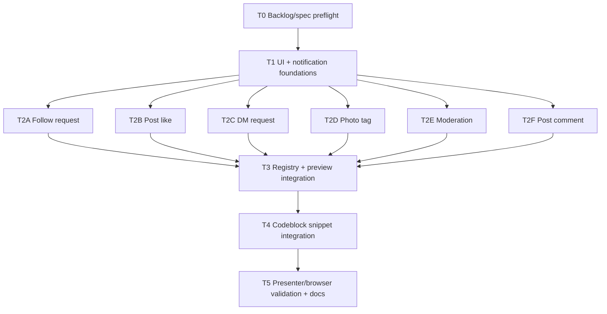

# Plan: Realistic Notification Variant Code

**Status:** Complete

## Initial Situation

The Remotion keynote currently has six fake notification preview variants and code-driven DX-panel slides. That solved the stage-readability problem, but the code shown in the slides is still partly illustrative. The user now wants to review real code on the side: actual working React notification variant implementations, with fake deterministic hooks standing in for reads, queries, and mutations.

The current app has:

- `remotion-presentation/src/components/preview/notification-preview-data.ts`: six fixture-like preview variants.
- `remotion-presentation/src/components/preview/mock-notification-preview.tsx`: a stage card renderer driven by `ui.variantId`.
- `remotion-presentation/src/slides/content.ts`: pseudo or abbreviated snippets for the talk.
- `remotion-presentation/src/slides/render-slide.tsx`: code-event mapping that currently infers preview state from code text and file names.
- `remotion-presentation/components.json`: shadcn config using `new-york`, Tailwind v4 CSS variables, neutral base, and aliases, but no `src/components/ui/*` primitives yet.

## Issue

The audience should see real compositional React code, not placeholder snippets that only resemble an implementation. Without runnable source-owned notification variants, the talk risks teaching the right design verbally while showing code that cannot be trusted as an example.

The current preview data and preview UI also duplicate the shape model that should belong to the actual notification implementation. That creates drift: the preview can say "named shapes" while the source still has a generic demo renderer.

## Solution Shape

Add a source-owned notification demo module in `remotion-presentation/src/notifications/`:

- discriminated notification types and deterministic fixtures for six variants;
- shadcn-style UI primitives in `src/components/ui/` for Card, Avatar, Button, and typography;
- notification primitives and context (`Notification.Container`, `Actor`, `SystemIcon`, `Body`, `Actions`, `Date`, etc.);
- one named working React component per variant;
- fake hooks per variant returning `{ state, actions, meta }`, with no real IO;
- a registry that proves every `NotificationType` maps to a renderer;
- slide code snippets sourced from or kept in sync with these runnable modules;
- `MockNotificationPreview` refactored to render the real components from fixtures instead of a parallel preview schema.

This is still talk-specific code. It must not import production Traevolution app components, routes, generated API types, real queries, real mutations, or app navigation.

## Resolved Decision Ledger

| Decision | Resolution | Reason |
| --- | --- | --- |
| Planning mode | Create plan only; no implementation in this turn. | User invoked `$create-plan`; skill contract forbids coding. |
| Owning surface | `remotion-presentation/` plus this wiki plan. | The product is the Remotion keynote, not the scaffolded wiki app. |
| Spec ownership | New follow-up plan folder: `wiki/specs/presentation/realistic-notification-variant-code/`. | Existing GH-12 plan is complete; this is follow-up scope. |
| Backlog provider | GitHub. | `wiki/backlog-provider.md` pins GitHub Projects and Issues. |
| Backlog sync | New GitHub story is required, but native creation failed with connector `403`. | Closed #13/#14 should not become owners of new work. |
| UI primitive strategy | Source-owned shadcn-style primitives under `src/components/ui/`; do not run shadcn install unless executor proves it necessary. | shadcn docs describe source-owned components and the repo already has config/tokens. |
| Variant scope | Existing six shapes: follow request, post like, DM request, photo tag, moderation, post comment. | Matches current deck and GH-12 acceptance. |
| Async/data strategy | Fake deterministic hooks only; no real effects, queries, mutations, routing, or IO. | The code must be runnable and realistic without production dependencies. |
| Parallelization | Implement six variants in parallel after shared foundations. | Variant files can own disjoint write scopes. |
| Presenter validation | Validate presenter URL, not only Studio; keep Studio for frame inspection. | Project notes identify Studio as debugging, presenter as delivery. |

## Assumptions And Constraints

- Upstream input is this explicit planning request; no sibling `SPEC.md` exists yet.
- If implementation requires strict wiki conformity before execution, create a short `SPEC.md` in this folder first or convert this plan into a spec-backed artifact.
- Existing uncommitted presenter/runtime work should not be reverted by implementers.
- TypeScript is strict with `noUnusedLocals`; exported demo modules must be referenced by registry, preview, snippets, or focused import checks.
- Remotion animation remains frame-driven. Fake hooks should derive data synchronously and deterministically.
- No visible presenter controls, debug labels, or route chrome should be added.

## Codebase Findings

- The current preview component is useful visually but is not the actual notification API.
- `render-slide.tsx` has fragile text/file-name inference for preview state; the plan should move to explicit typed preview steps.
- `LiveCodeCompilation` already supports `codeEvents` and `renderPreview`, so the integration task should reuse it instead of replacing the split layout.
- `components.json` already defines the intended shadcn aliases, but `src/components/ui/` is absent.
- The current slide content already names the concepts the real module needs: supported exports, inner context, registry, notification type union, moderation composition, and post-comment composition.

## Research Used

- Existing GH-12 docs and grill notes for six-variant notification scope and fake/stage-readable constraints.
- Read-only explorer findings for current preview architecture, slide integration, and wiki/backlog placement.
- Official shadcn docs:
  - Card composition uses `Card`, `CardHeader`, `CardTitle`, `CardDescription`, `CardContent`, and `CardFooter`.
  - Avatar composition uses `Avatar`, `AvatarImage`, and `AvatarFallback`.
  - Button supports variants such as `default`, `outline`, `secondary`, `ghost`, and `destructive`.
  - Typography is example utility/class guidance, not a shipped default primitive, so the project should source-own typography wrappers.

## Required Inner Phases

### Grill Phase

No blocking user question remains.

Locked by the user:

- actual working React notification code is required;
- mutations and queries are mocked through fake hooks;
- shadcn Card, Avatar, Button, and typography primitives are the visual substrate;
- existing notification variants are the default implementation set;
- each notification implementation can be parallelized.

Deferred but non-blocking:

- GitHub backlog story creation is required before implementation closeout, but connector permissions blocked creation during planning.

### Parallel Research Phase

Used. Three read-only subagents inspected:

- current notification preview architecture and recommended module boundaries;
- slide/codeblock integration and preview-state mapping;
- wiki/backlog placement and tracker requirements.

Main-thread discovery also checked the scoped `AGENTS.md` chain, existing plans, shadcn config, current slide snippets, and official shadcn docs.

### Swarm Planner Phase

The graph uses one shared foundation task, then six variant tasks with disjoint write scopes, then integration and validation tasks. Workers must treat each other as active in the same codebase and must not revert unrelated edits.

### TDD Phase

Every implementation task has a public behavior RED target. Tests/checks should exercise public imports, registry coverage, rendered variant output, and presenter/browser behavior rather than private helpers.

## Dependency Graph

## Parallel Execution Waves

### Wave 0

- T0 confirms or creates the product-facing GitHub story and, if required, a sibling `SPEC.md`.

### Wave 1

- T1 builds shared foundations.

### Wave 2

- T2A, T2B, T2C, T2D, T2E, and T2F run in parallel. Each owns one variant file/hook and fixture slice.

### Wave 3

- T3 integrates variants into registry and preview.
- T4 wires realistic code snippets into slides and typed preview steps.

### Wave 4

- T5 validates, records evidence, and syncs docs/backlog.

## Tasks

### T0: Backlog And Spec Preflight

- **depends_on**: []
- **location**: `wiki/specs/presentation/realistic-notification-variant-code/**`, GitHub issues
- **description**: Create or identify the product-facing GitHub story for this follow-up and add a short sibling `SPEC.md` if implementation workflow requires one. Link prior GH-12/#13/#14 as context, not owners.
- **validation**: A real story id/url is available for all later tasks; plan frontmatter/links are updated if a sibling `SPEC.md` or issue is created.
- **status**: Complete
- **log**: Planning attempted GitHub issue creation for "Build realistic React notification variant code for keynote"; connector returned `403 Resource not accessible by integration`. T0 created the required sibling `SPEC.md` and `IMPLEMENTATION-NOTES.md`; backlog story remains blocked by connector permissions and is recorded as closeout-blocking only.
- **files edited/created**:
- `wiki/specs/presentation/realistic-notification-variant-code/SPEC.md`
- `wiki/specs/presentation/realistic-notification-variant-code/IMPLEMENTATION-NOTES.md`
- **backlog_item_id**: TBD-new-GitHub-story
- **backlog_item_url**: TBD-new-GitHub-story-url
- **relation_mode**: native
- **assigned_skills**: [`create-plan`, `write-backlog`, `simplify`]
- **tdd_target**: First prove there is no open owning story for this follow-up, then create or identify exactly one product-facing story before implementation tasks close.
- **review_mode**: cli

### T1: Add UI And Notification Foundations

- **depends_on**: [T0]
- **location**: `remotion-presentation/src/components/ui/**`, `remotion-presentation/src/notifications/types.ts`, `remotion-presentation/src/notifications/fixtures.ts`, `remotion-presentation/src/notifications/context.tsx`, `remotion-presentation/src/notifications/primitives.tsx`, `remotion-presentation/src/notifications/index.ts`
- **description**: Add source-owned shadcn-style Card, Avatar, Button, and typography primitives using existing stage tokens. Add discriminated notification types, deterministic fixtures, strict notification context, shared notification primitives, and a public notification module barrel. Keep primitives small and avoid generic prop bags that recreate the original problem.
- **validation**: Public imports compile; `NotificationType` covers six variants; primitives render without production imports; search confirms no app routes, queries, mutations, or production component imports.
- **status**: Complete
- **log**:
- RED: `bun -e "await import('./src/notifications/index.ts'); ..."` failed because `src/notifications` and `src/components/ui/*` did not exist.
- GREEN: Added source-owned shadcn-style Card, Avatar, Button, and typography primitives; added notification types, fixtures, strict context, primitives, fake action helpers, and public barrel.
- Focused validation passed: `bun -e "await import('./src/notifications/index.ts')"` and `bunx eslint src/components/ui src/notifications`.
- **files edited/created**:
- `remotion-presentation/src/components/ui/avatar.tsx`
- `remotion-presentation/src/components/ui/button.tsx`
- `remotion-presentation/src/components/ui/card.tsx`
- `remotion-presentation/src/components/ui/index.ts`
- `remotion-presentation/src/components/ui/typography.tsx`
- `remotion-presentation/src/notifications/context.tsx`
- `remotion-presentation/src/notifications/fixtures.ts`
- `remotion-presentation/src/notifications/index.ts`
- `remotion-presentation/src/notifications/primitives.tsx`
- `remotion-presentation/src/notifications/types.ts`
- **backlog_item_id**: TBD-new-GitHub-story
- **backlog_item_url**: TBD-new-GitHub-story-url
- **relation_mode**: native
- **assigned_skills**: [`frontend-domain-structure`, `quality-types`, `design-taste-frontend`, `vercel-composition-patterns`, `vercel-react-best-practices`, `tdd`, `simplify`]
- **tdd_target**: First prove `src/notifications` and `src/components/ui/{card,avatar,button,typography}` public imports do not exist, then add a compiling foundation with six typed notification shapes.
- **review_mode**: cli

### T2A: Implement Follow Request Notification

- **depends_on**: [T1]
- **location**: `remotion-presentation/src/notifications/variants/follow-request-notification.tsx`
- **description**: Implement `useFollowRequestNotification(notification)` and `FollowRequestNotification`. Render actor avatar, body/mutual context, follow-back and ignore actions using the shared primitives and fake actions.
- **validation**: Component renders the follow-request fixture through the public variant export; action labels are visible; no real mutation or routing code exists.
- **status**: Complete
- **log**:
- RED: Worker confirmed `follow-request-notification.tsx` was missing before implementation.
- GREEN: Added `useFollowRequestNotification` and `FollowRequestNotification` using shared notification primitives and fake actions.
- Worker validation rendered the follow-request fixture and confirmed title, mutual context, `Follow back`, and `Ignore`; focused ESLint passed.
- **files edited/created**:
- `remotion-presentation/src/notifications/variants/follow-request-notification.tsx`
- **backlog_item_id**: TBD-new-GitHub-story
- **backlog_item_url**: TBD-new-GitHub-story-url
- **relation_mode**: native
- **assigned_skills**: [`async-react-patterns`, `frontend-domain-structure`, `quality-types`, `design-taste-frontend`, `tdd`, `simplify`]
- **tdd_target**: First prove the public follow-request variant export is missing, then add a component that renders avatar, context, and follow/ignore fake actions from fixture data.
- **review_mode**: mixed

### T2B: Implement Post Like Notification

- **depends_on**: [T1]
- **location**: `remotion-presentation/src/notifications/variants/post-like-notification.tsx`
- **description**: Implement `usePostLikeNotification(notification)` and `PostLikeNotification`. Render actor avatar, body, post thumbnail/context, timestamp, and a view-post fake action.
- **validation**: Component renders the post-like fixture through the public variant export; thumbnail/context is visible; no real link/navigation dependency exists.
- **status**: Complete
- **log**:
- RED: Worker confirmed the public post-like variant file/import was missing before implementation.
- GREEN: Added `usePostLikeNotification` and `PostLikeNotification` using shared notification primitives and fake `View post` action.
- Worker validation imported and server-rendered the post-like fixture; focused ESLint passed and forbidden-surface scan found no real IO/routing/effects.
- **files edited/created**:
- `remotion-presentation/src/notifications/variants/post-like-notification.tsx`
- **backlog_item_id**: TBD-new-GitHub-story
- **backlog_item_url**: TBD-new-GitHub-story-url
- **relation_mode**: native
- **assigned_skills**: [`async-react-patterns`, `frontend-domain-structure`, `quality-types`, `design-taste-frontend`, `tdd`, `simplify`]
- **tdd_target**: First prove the public post-like variant export is missing, then add a component that renders actor, body, thumbnail, and view-post fake action from fixture data.
- **review_mode**: mixed

### T2C: Implement DM Request Notification

- **depends_on**: [T1]
- **location**: `remotion-presentation/src/notifications/variants/dm-request-notification.tsx`
- **description**: Implement `useDMRequestNotification(notification)` and `DMRequestNotification`. Render actor avatar, message preview, request context, accept and ignore fake actions.
- **validation**: Component renders the DM-request fixture through the public variant export; message preview and accept/ignore actions are visible; no real messaging API exists.
- **status**: Complete
- **log**:
- RED: Worker confirmed the DM-request variant module was missing before implementation.
- GREEN: Added `useDMRequestNotification` and `DMRequestNotification` with message preview plus fake `Accept`/`Ignore` actions.
- Worker validation server-rendered the fixture and confirmed preview/actions; focused ESLint and Prettier checks passed.
- **files edited/created**:
- `remotion-presentation/src/notifications/variants/dm-request-notification.tsx`
- **backlog_item_id**: TBD-new-GitHub-story
- **backlog_item_url**: TBD-new-GitHub-story-url
- **relation_mode**: native
- **assigned_skills**: [`async-react-patterns`, `frontend-domain-structure`, `quality-types`, `design-taste-frontend`, `tdd`, `simplify`]
- **tdd_target**: First prove the public DM-request variant export is missing, then add a component that renders message preview and accept/ignore fake actions from fixture data.
- **review_mode**: mixed

### T2D: Implement Photo Tag Notification

- **depends_on**: [T1]
- **location**: `remotion-presentation/src/notifications/variants/photo-tag-notification.tsx`
- **description**: Implement `usePhotoTagNotification(notification)` and `PhotoTagNotification`. Render actor avatar, photo thumbnail, review copy, view-photo and remove-tag fake actions.
- **validation**: Component renders the photo-tag fixture through the public variant export; media thumbnail and remove-tag action are visible; no real media or mutation dependency exists.
- **status**: Complete
- **log**:
- RED: Worker confirmed the photo-tag variant module was missing before implementation.
- GREEN: Added `usePhotoTagNotification` and `PhotoTagNotification` with media review UI plus fake `View photo`/`Remove tag` actions.
- Worker validation rendered the fixture and confirmed media/action labels; focused ESLint passed.
- **files edited/created**:
- `remotion-presentation/src/notifications/variants/photo-tag-notification.tsx`
- **backlog_item_id**: TBD-new-GitHub-story
- **backlog_item_url**: TBD-new-GitHub-story-url
- **relation_mode**: native
- **assigned_skills**: [`async-react-patterns`, `frontend-domain-structure`, `quality-types`, `design-taste-frontend`, `tdd`, `simplify`]
- **tdd_target**: First prove the public photo-tag variant export is missing, then add a component that renders media review UI and view/remove fake actions from fixture data.
- **review_mode**: mixed

### T2E: Implement Moderation Notification

- **depends_on**: [T1]
- **location**: `remotion-presentation/src/notifications/variants/moderation-notification.tsx`
- **description**: Implement `useModerationNotification(notification)` and `ModerationNotification`. Render system icon instead of actor avatar, body, report reason/meta, visibility state, view-decision and appeal fake actions.
- **validation**: Component renders the moderation fixture through the public variant export; no actor link/avatar is used; system icon, reason, and appeal/action path are visible.
- **status**: Complete
- **log**:
- RED: Worker confirmed the moderation variant module was missing before implementation.
- GREEN: Added `useModerationNotification` and `ModerationNotification` with system icon, reason, visibility, and fake `View decision`/`Appeal` actions.
- Worker validation imported/rendered the fixture and confirmed moderation text/actions; focused ESLint and forbidden-pattern scan passed.
- **files edited/created**:
- `remotion-presentation/src/notifications/variants/moderation-notification.tsx`
- **backlog_item_id**: TBD-new-GitHub-story
- **backlog_item_url**: TBD-new-GitHub-story-url
- **relation_mode**: native
- **assigned_skills**: [`async-react-patterns`, `frontend-domain-structure`, `quality-types`, `design-taste-frontend`, `tdd`, `simplify`]
- **tdd_target**: First prove the public moderation variant export is missing, then add a component that renders system-icon composition and decision/appeal fake actions from fixture data.
- **review_mode**: mixed

### T2F: Implement Post Comment Notification

- **depends_on**: [T1]
- **location**: `remotion-presentation/src/notifications/variants/post-comment-notification.tsx`
- **description**: Implement `usePostCommentNotification(notification)` and `PostCommentNotification`. Render actor avatar, body, comment preview, post/thread thumbnail, reply fake action, and timestamp.
- **validation**: Component renders the post-comment fixture through the public variant export; comment preview, thumbnail, and reply action are visible; no real comment mutation exists.
- **status**: Complete
- **log**:
- RED: Worker confirmed the post-comment variant module was missing before implementation.
- GREEN: Added `usePostCommentNotification` and `PostCommentNotification` with comment preview, thread media, and fake `Reply` action.
- Worker validation rendered the fixture and confirmed comment/media/action labels; focused ESLint passed.
- **files edited/created**:
- `remotion-presentation/src/notifications/variants/post-comment-notification.tsx`
- **backlog_item_id**: TBD-new-GitHub-story
- **backlog_item_url**: TBD-new-GitHub-story-url
- **relation_mode**: native
- **assigned_skills**: [`async-react-patterns`, `frontend-domain-structure`, `quality-types`, `design-taste-frontend`, `tdd`, `simplify`]
- **tdd_target**: First prove the public post-comment variant export is missing, then add a component that renders comment preview, thumbnail, and reply fake action from fixture data.
- **review_mode**: mixed

### T3: Integrate Registry And Preview Renderer

- **depends_on**: [T2A, T2B, T2C, T2D, T2E, T2F]
- **location**: `remotion-presentation/src/notifications/registry.tsx`, `remotion-presentation/src/components/preview/mock-notification-preview.tsx`, `remotion-presentation/src/components/preview/notification-preview-data.ts`
- **description**: Add a typed `Record<NotificationType, NotificationRenderer>` registry and refactor the preview panel to render real notification variant components from fixtures. Remove parallel card-rendering logic that duplicates the variant schema unless a tiny stage wrapper is still needed around the real component.
- **validation**: Registry compile-fails if any `NotificationType` is missing; `MockNotificationPreview` renders every fixture via the registry; no duplicate preview-only schema remains except stage metadata needed by the panel.
- **status**: Complete
- **log**:
- RED: `MockNotificationPreview` bypassed the real notification module and rendered its own `NotificationCard`; `registry.tsx` and `variants/index.ts` were missing.
- GREEN: Added exhaustive `notificationRenderers satisfies Record<NotificationType, NotificationRenderer>`, variant barrel exports, and public notification barrel exports. Refactored `MockNotificationPreview` to resolve fixtures and render real components through the registry.
- Validation passed: focused ESLint for preview/registry files and `bunx tsc --noEmit --pretty false`.
- **files edited/created**:
- `remotion-presentation/src/notifications/registry.tsx`
- `remotion-presentation/src/notifications/variants/index.ts`
- `remotion-presentation/src/notifications/index.ts`
- `remotion-presentation/src/components/preview/mock-notification-preview.tsx`
- `remotion-presentation/src/components/preview/notification-preview-data.ts`
- **backlog_item_id**: TBD-new-GitHub-story
- **backlog_item_url**: TBD-new-GitHub-story-url
- **relation_mode**: native
- **assigned_skills**: [`frontend-domain-structure`, `quality-types`, `design-taste-frontend`, `tdd`, `simplify`, `agent-browser`]
- **tdd_target**: First prove preview rendering can bypass the notification registry, then make the public registry the only path used by the DX panel.
- **review_mode**: mixed

### T4: Wire Realistic Code Snippets And Explicit Preview Steps

- **depends_on**: [T3]
- **location**: `remotion-presentation/src/slides/content.ts`, `remotion-presentation/src/slides/render-slide.tsx`, `remotion-presentation/src/slides/types.ts`, optional `remotion-presentation/src/slides/notification-code-snippets.ts`
- **description**: Replace pseudo snippets with realistic code derived from the runnable notification module. Add explicit typed `previewSteps` to code-DX slide content so preview state is not inferred by string matching. Keep code-DX slides focused on meaningful shape moments: generic moderation props, supported export list, named moderation composition, and post-comment composition.
- **validation**: Code-DX slide content compiles; preview steps are typed against notification variant ids; no `resolvePreviewVariant` string/file-name heuristic remains; representative frames show expected variants.
- **status**: Complete
- **log**:
- RED: `rg` showed `render-slide.tsx` still used `resolvePreviewVariant`, `line.includes(...)`, and `fileName.includes(...)` to map preview state.
- GREEN: Added realistic notification snippets, typed `previewSteps`, and explicit line-based preview state mapping. Removed the string/file-name heuristic.
- Validation passed: `rg` shows only typed `previewSteps`, `bunx tsc --noEmit --pretty false`, and focused ESLint for slides/preview/notifications.
- **files edited/created**:
- `remotion-presentation/src/slides/notification-code-snippets.ts`
- `remotion-presentation/src/slides/types.ts`
- `remotion-presentation/src/slides/render-slide.tsx`
- `remotion-presentation/src/slides/content.ts`
- **backlog_item_id**: TBD-new-GitHub-story
- **backlog_item_url**: TBD-new-GitHub-story-url
- **relation_mode**: native
- **assigned_skills**: [`frontend-domain-structure`, `quality-types`, `vercel-composition-patterns`, `tdd`, `simplify`, `agent-browser`]
- **tdd_target**: First prove preview mapping depends on string/file-name inference, then replace it with explicit typed preview steps connected to realistic source snippets.
- **review_mode**: mixed

### T5: Validate Presenter, Stills, Docs, And Backlog

- **depends_on**: [T4]
- **location**: `remotion-presentation/**`, `wiki/specs/presentation/realistic-notification-variant-code/**`, GitHub story
- **description**: Run final CLI and browser validation. Validate both Remotion Studio frames and the presenter URL. Update this plan with implementation logs, evidence, touched files, and final backlog/story state.
- **validation**: `bun run lint` passes or exact unrelated blockers are recorded; `bun run build` passes; representative stills for moderation and post-comment render; presenter URL opens and keyboard navigation reaches relevant slides; story/backlog link is updated in this plan.
- **status**: Complete
- **log**:
- RED: Final validation evidence and backlog link were absent before T5.
- GREEN: `bun run lint` passed, `bun run build` passed with the existing Remotion `zod` version warning, representative moderation and post-comment stills rendered and were visually inspected, presenter opened at `http://localhost:3001/`, and keyboard navigation worked.
- Backlog story creation remains blocked by GitHub connector `403 Resource not accessible by integration`; implementation is otherwise complete and the blocker is recorded in `IMPLEMENTATION-NOTES.md`.
- Generated `remotion-presentation/build/` was removed after build validation.
- **files edited/created**:
- `wiki/specs/presentation/realistic-notification-variant-code/SPEC.md`
- `wiki/specs/presentation/realistic-notification-variant-code/PLAN.md`
- `wiki/specs/presentation/realistic-notification-variant-code/IMPLEMENTATION-NOTES.md`
- `wiki/index.md`
- `wiki/specs/presentation/presentation-specs.md`
- `wiki/log.md`
- **backlog_item_id**: TBD-new-GitHub-story
- **backlog_item_url**: TBD-new-GitHub-story-url
- **relation_mode**: native
- **assigned_skills**: [`agent-browser`, `autoreview`, `create-plan`, `implement-spec`, `tdd`, `simplify`]
- **tdd_target**: First prove final validation evidence and backlog link are absent, then update the plan only after checks and browser validation complete.
- **review_mode**: mixed

## Testing Strategy

- Add or use a focused public import check for `src/notifications`.
- Use TypeScript registry coverage as a compile-time test.
- Run `cd remotion-presentation && bun run lint`.
- Run `cd remotion-presentation && bun run build`.
- Render representative stills for moderation and post-comment code-DX frames.
- Start `bun run presenter` and validate the clean presenter surface, not just Remotion Studio.
- Search for forbidden imports/behaviors:
  - no production app imports;
  - no real query/mutation hooks;
  - no route/navigation dependency;
  - no `useEffect`-driven fake data.

## Risks And Mitigations

| Risk | Mitigation |
| --- | --- |
| New notification primitives become a generic prop-soup API. | Keep primitives internal to named variants; public exports are named supported shapes and registry. |
| Preview schema and notification schema drift. | Render preview through real fixtures and registry; remove duplicated preview-only variant data where possible. |
| Parallel variant workers conflict. | T2 workers own one variant file each; shared foundations complete first; registry integration waits until all variants finish. |
| Fake hooks become unrealistic or too complex. | Hooks are deterministic derivations returning `{ state, actions, meta }`; no async, no effects, no IO. |
| Code snippets drift from runnable source. | Source snippets from the real notification module or keep a dedicated snippet file reviewed against source exports. |
| Browser validation misses intra-slide changes because presenter is slide-level. | Use Studio/still frame validation for intra-slide code-DX timing until slide-local cue arrays are ported. |

## Validation Gates

### Gate 1: Foundations

- shadcn-style primitives compile.
- Notification union and fixtures exist.
- Shared context/primitives compile.
- No production imports.

### Gate 2: Six Variants

- Each named variant renders from a fixture.
- Each fake hook returns `{ state, actions, meta }`.
- Actions are fake and deterministic.
- Variant files are independent enough to review in parallel.

### Gate 3: Registry And Preview

- Registry covers every `NotificationType`.
- Preview panel renders real variants through registry.
- Duplicated preview-only schema is removed or minimized.

### Gate 4: Slides And Presenter

- Codeblocks show realistic React source.
- Preview mapping uses explicit typed steps.
- Build/lint/stills/browser checks pass or exact unrelated blockers are recorded.

## Backlog Sync

- Provider: GitHub Projects and Issues.
- Existing related context: #12, #13, #14.
- Required owning story: new follow-up issue for realistic notification variant code.
- Sync attempt during planning: GitHub connector `_create_issue` returned `403 Resource not accessible by integration`; no issue was created.
- Implementation closeout status: blocked by connector permissions. The implementation is complete, but the plan keeps `TBD-new-GitHub-story` because native issue creation failed with `403 Resource not accessible by integration`.

## Unresolved Questions

- **Owning GitHub story id/url:** unresolved because native issue creation was blocked by connector permissions. This blocks tracker closeout only; implementation and validation are complete.
