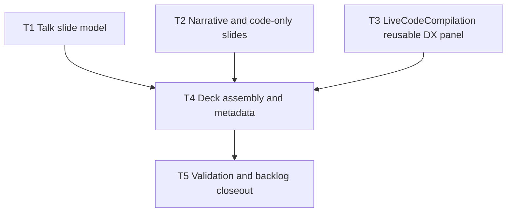

# Plan: Remocn Slide System And Motion Vocabulary

**Status:** Complete

## Initial Situation

The repo has a Remotion React/TypeScript presentation in `remotion-presentation/` and project knowledge in `wiki/`. A prior visual-system spec implemented dark JavaScript tokens, 1920x1080/60fps metadata, and three stage families: narrative, code-only, and code-plus-DX-panel. The current `MyComp` composition still renders only that three-slide proof.

GitHub epic #5 asks for the reusable slide system that turns the pinned talk content into a coherent Remotion-native keynote. Story #6 requires narrative slides with classic Remocn typography. Story #7 requires code-only moments through `GlassCodeBlock`. Story #8 requires code-plus-DX-panel slides through `LiveCodeCompilation`; the story is closed on GitHub, but the current `main` branch does not contain the parameterized implementation described in the closeout comment.

## Issue

The deck cannot yet present the actual talk. The slide content exists, and Remocn components exist, but the app lacks a data-driven slide model, reusable talk-specific slide components, the restored parameterized `LiveCodeCompilation` surface, and browser validation across representative slide families.

## Solution Shape

Build a small Remotion-native keynote layer:

- canonical talk slide definitions sourced from `slides-content.md`;
- narrative slide components that support title, subtitle, bullet groups, emphasis copy, and classic Remocn typography entrances;
- code-only slide components that wrap `GlassCodeBlock` for large readable snippets;
- a parameterized code-plus-DX-panel slide path based on `LiveCodeCompilation`;
- a `Series`-based deck composition whose duration derives from slide definitions;
- tests and browser validation proving narrative/code/DX moments render.

## Assumptions And Constraints

- The pinned slide source has 16 slides and should remain semantically intact.
- The implementation may encode the slide content as typed data rather than parse Markdown at runtime.
- "Classic Remocn typography" means restrained fade/up/highlight/title replacement motion from installed components, not glitch/wipe-heavy effects.
- `LiveCodeCompilation` may be restored from the existing branch evidence, but only the reusable behavior needed for this epic should be carried forward.
- Use full parallel mode for implementation waves.
- Keep changes scoped to `remotion-presentation/` and `wiki/`.

## Resolved Decision Ledger

| Decision | Resolution | Reason |
|----------|------------|--------|
| Branch | `team/stefan/epic-5-composition-react-delivery` | User requested a new branch for the epic; repo branch prefix convention is `team/stefan/`. |
| Spec domain | `presentation` | Scope is the Remotion keynote. |
| Execution mode | `parallel` | User explicitly requested full parallel with subagents. |
| Parallel research | Used | One explorer covers content/backlog mapping; one covers Remotion implementation seams. |
| Grill phase | No blocking question | GitHub issues and grill docs lock scope, constraints, and acceptance. |
| TDD strategy | Public behavior tracers | Use import checks, metadata/duration checks, tests, Remotion stills, and browser snapshots. |

## Required Inner Phases

### Grill Phase

No user question is required. The backlog already locks:

- Remocn components create the presentation.
- No tech/glitch typography.
- Code-plus-DX panel appears only where code demonstrates meaningful shape change.
- Code-only slides use `GlassCodeBlock`.
- Narrative slides use classic Remocn typography and readable holds.

### Parallel Research Phase

Used. Sidecar explorers were assigned independent readonly questions:

- content/backlog mapping across `slides-content.md`, `deck-beats.md`, `fragments.md`, and grill docs;
- current Remotion implementation, existing Remocn components, #8 branch evidence, and safe implementation surfaces.

### Swarm Planner Phase

The task graph uses three waves. Wave 1 has independent slide data and reusable component work. Wave 2 assembles the deck from those public surfaces. Wave 3 validates, reviews, and closes docs/backlog.

### TDD Phase

Each task starts from one public behavior that is currently absent or incomplete, then records RED -> GREEN evidence or an explicit non-testable visual verification path.

## Dependency Graph

## Parallel Execution Waves

### Wave 1

- T1, T2, and T3 can run in parallel with disjoint write scopes.

### Wave 2

- T4 integrates the slide model and reusable components into the composition.

### Wave 3

- T5 runs final validation, browser checks, implementation-note finalization, PR, merge, and issue closeout.

## Tasks

### T1: Encode the pinned talk as typed slide data

- **depends_on**: []
- **location**: `remotion-presentation/src/slides/content.ts`, `remotion-presentation/src/slides/types.ts`, `slides-content.md`
- **description**: Create typed slide definitions for the pinned 16-slide talk. Preserve titles, subtitles, bullets, emphasis, code snippets, and each slide family (`narrative`, `code-only`, `code-dx`) without runtime Markdown parsing.
- **validation**: A public import exposes 16 ordered slides; every slide has an id, title, family, duration, and content payload; code-bearing slides expose non-empty code snippets.
- **status**: Implemented
- **log**: RED: `bun -e 'import { talkSlides } from "./src/slides"; ...'` failed because `./src/slides` did not exist. GREEN: focused Bun import check confirms 16 ordered slides, required fields, pinned family mapping, and non-empty snippets for code-bearing slides; focused `tsc` probe for `src/slides/index.ts` passes with `--skipLibCheck`.
- **files edited/created**: `remotion-presentation/src/slides/types.ts`, `remotion-presentation/src/slides/content.ts`, `remotion-presentation/src/slides/index.ts`
- **backlog_item_id**: #5
- **backlog_item_url**: https://github.com/stefan-garofalo/torinojs-composition/issues/5
- **assigned_skills**: [`agent-browser`, `async-react-patterns`, `design-taste-frontend`, `frontend-domain-structure`, `quality-types`, `vercel-composition-patterns`, `vercel-react-best-practices`, `tdd`, `simplify`, `remotion-best-practices`]
- **tdd_target**: First prove there is no public `talkSlides` export containing 16 keyed talk slides, then add it.
- **review_mode**: cli

### T2: Build narrative and code-only slide renderers

- **depends_on**: []
- **location**: `remotion-presentation/src/slides/narrative-slide.tsx`, `remotion-presentation/src/slides/code-only-slide.tsx`, `remotion-presentation/src/components/stage/**`
- **description**: Add reusable slide renderers for narrative and code-only moments. Narrative slides support title, subtitle, bullets, emphasis lines, and classic Remocn typography entrances. Code-only slides use `GlassCodeBlock` and shared motion/readability constants.
- **validation**: Public imports expose both renderers; `NarrativeTalkSlide` renders title/subtitle/bullets/emphasis props; `CodeOnlyTalkSlide` renders `GlassCodeBlock`; no tech/glitch Remocn components are used.
- **status**: Implemented
- **log**: RED: focused `tsc` import probe for `NarrativeTalkSlide` and `CodeOnlyTalkSlide` from `./src/slides` failed because `./src/slides` did not exist. GREEN: focused import/type probe passes; `rg` confirms `NarrativeTalkSlide` uses `StaggeredFadeUp`, `InlineHighlight`, and `MarkerHighlight`, `CodeOnlyTalkSlide` uses `GlassCodeBlock`, and no glitch/wipe components are referenced in T2 files; `npx eslint src` passes. Full `npm run lint` remains blocked by pre-existing `oxlint.config.ts` Ultracite module-resolution/config typing errors.
- **files edited/created**: `remotion-presentation/src/slides/narrative-slide.tsx`, `remotion-presentation/src/slides/code-only-slide.tsx`, `remotion-presentation/src/slides/index.ts`
- **backlog_item_id**: #6, #7
- **backlog_item_url**: https://github.com/stefan-garofalo/torinojs-composition/issues/6, https://github.com/stefan-garofalo/torinojs-composition/issues/7
- **assigned_skills**: [`agent-browser`, `async-react-patterns`, `design-taste-frontend`, `frontend-domain-structure`, `quality-types`, `vercel-composition-patterns`, `vercel-react-best-practices`, `tdd`, `simplify`, `remotion-best-practices`]
- **tdd_target**: First prove the public renderers are absent, then add importable components whose rendered source includes classic typography and `GlassCodeBlock`.
- **review_mode**: mixed

### T3: Restore reusable LiveCodeCompilation DX-panel support

- **depends_on**: []
- **location**: `remotion-presentation/src/components/remocn/live-code-compilation.tsx`, `remotion-presentation/src/slides/code-dx-slide.tsx`, `remotion-presentation/src/components/preview/**`
- **description**: Make `LiveCodeCompilation` reusable with custom code events, titles, sizing, split ratios, and a right-side preview render prop. Add a code-plus-DX slide wrapper and a notification preview that proves meaningful shape change.
- **validation**: Public imports expose `CodeEvent`, `UIState`, and a `renderPreview` path; the default demo still works; custom code events and preview state can render without replacing the whole component.
- **status**: Completed
- **log**: 2026-06-08 T3 restored `LiveCodeCompilation` as a reusable DX-panel primitive. RED evidence: a temporary public API type-check failed because `CodeEvent`/`UIState` were local-only and `codeEvents` was not accepted by props. GREEN evidence: focused TypeScript public API check passes for exported `CodeEvent`/`UIState`, custom `codeEvents`, `codeTitle`, sizing/split props, `renderPreview`, and `CodeDxTalkSlide`; focused ESLint passes for T3 files. Full `bun run lint` remains blocked by pre-existing `oxlint.config.ts` ultracite module-resolution/type errors outside T3.
- **files edited/created**: `remotion-presentation/src/components/remocn/live-code-compilation.tsx`, `remotion-presentation/src/slides/code-dx-slide.tsx`, `remotion-presentation/src/components/preview/mock-notification-preview.tsx`, `remotion-presentation/src/slides/index.ts`, `wiki/specs/presentation/remocn-slide-system/PLAN.md`.
- **backlog_item_id**: #8
- **backlog_item_url**: https://github.com/stefan-garofalo/torinojs-composition/issues/8
- **assigned_skills**: [`agent-browser`, `async-react-patterns`, `design-taste-frontend`, `frontend-domain-structure`, `quality-types`, `vercel-composition-patterns`, `vercel-react-best-practices`, `tdd`, `simplify`, `remotion-best-practices`]
- **tdd_target**: First prove `LiveCodeCompilation` lacks custom `codeEvents`/`renderPreview` support on current branch, then add that public behavior.
- **review_mode**: mixed

### T4: Assemble the Remocn keynote composition

- **depends_on**: [T1, T2, T3]
- **location**: `remotion-presentation/src/Composition.tsx`, `remotion-presentation/src/Root.tsx`, `remotion-presentation/src/slides/index.ts`, `remotion-presentation/src/slides/render-slide.tsx`
- **description**: Replace the three-family sample with a `Series` deck that renders the typed talk slides through the reusable slide renderers. Keep 1920x1080/60fps metadata and compute duration from slide definitions.
- **validation**: `MyComp` duration equals the sum of slide durations; all 16 slides are reachable in order; representative narrative, code-only, and code-DX frames render with non-null output.
- **status**: Implemented
- **log**: 2026-06-08 T4 assembled `MyComp` as a `Series` over all 16 `talkSlides`, with `VISUAL_SYSTEM_DURATION_IN_FRAMES` computed from slide data. RED evidence: focused Bun check showed current duration `540` vs expected slide sum `7380`, proving the three-family sample was still wired. GREEN evidence: focused Bun import/render-element check confirms 16 ordered slide ids, 1920x1080/60fps metadata, `7380` duration equals slide sum, and representative narrative/code-only/code-DX render paths return non-null elements; `npx eslint src` passes; focused JSX TypeScript probe for T4 files passes; Remotion stills rendered for frames 30, 1930, and 1290 to `/tmp/remocn-t4-narrative.png`, `/tmp/remocn-t4-code-only.png`, and `/tmp/remocn-t4-code-dx.png` as 480x270 PNGs. Full `bun run lint` remains blocked by the pre-existing `oxlint.config.ts` Ultracite module-resolution/config typing errors outside T4; the code-DX still completed despite a transient webpack cache rename warning.
- **files edited/created**: `remotion-presentation/src/Composition.tsx`, `remotion-presentation/src/slides/render-slide.tsx`, `remotion-presentation/src/slides/index.ts`, `wiki/specs/presentation/remocn-slide-system/PLAN.md`
- **backlog_item_id**: #5
- **backlog_item_url**: https://github.com/stefan-garofalo/torinojs-composition/issues/5
- **assigned_skills**: [`agent-browser`, `async-react-patterns`, `design-taste-frontend`, `frontend-domain-structure`, `quality-types`, `vercel-composition-patterns`, `vercel-react-best-practices`, `tdd`, `simplify`, `remotion-best-practices`]
- **tdd_target**: First prove the current composition has only three sample sequences, then make the composition expose the full 16-slide talk duration and renderer path.
- **review_mode**: mixed

### T5: Validate, finalize docs, PR, merge, and close backlog

- **depends_on**: [T4]
- **location**: `wiki/specs/presentation/remocn-slide-system/**`, `wiki/index.md`, `wiki/specs/presentation/presentation-specs.md`, `wiki/log.md`, GitHub issues #5/#6/#7/#8`
- **description**: Run lint/build/tests/still renders, validate the local Remotion Studio with `agent-browser`, update plan and implementation notes, set spec status to implemented, create a PR, rebase-merge it to `main`, and close the remaining backlog issues.
- **validation**: Required commands and browser checks are recorded; acceptance audit is complete; PR is merged; #5/#6/#7 are closed and #8 remains linked with verification evidence.
- **status**: Complete
- **log**: 2026-06-08 T5 finalized validation and documentation. RED evidence: spec/index metadata still reported Approved/Planned and GitHub issues #5/#6/#7 were open. GREEN evidence: `bun run lint` passes after excluding non-runtime `oxlint.config.ts` from the app type-check, `bun run build` passes, focused metadata check confirms 16 slides, 7380-frame duration, 1920x1080, and 60fps, Remotion stills render for narrative/code-only/code-DX frames, and `agent-browser` validates Remotion Studio at the initial narrative slide plus frame 1900 code-only and frame 1290 code-DX.
- **files edited/created**: `wiki/specs/presentation/remocn-slide-system/SPEC.md`, `wiki/specs/presentation/remocn-slide-system/PLAN.md`, `wiki/specs/presentation/remocn-slide-system/IMPLEMENTATION-NOTES.md`, `wiki/index.md`, `wiki/specs/presentation/presentation-specs.md`, `wiki/log.md`, `.agents/notes/remocn-typography-background.md`, `.agents/notes/index.md`
- **backlog_item_id**: #5, #6, #7, #8
- **backlog_item_url**: https://github.com/stefan-garofalo/torinojs-composition/issues/5, https://github.com/stefan-garofalo/torinojs-composition/issues/6, https://github.com/stefan-garofalo/torinojs-composition/issues/7, https://github.com/stefan-garofalo/torinojs-composition/issues/8
- **assigned_skills**: [`create-spec`, `create-plan`, `implement-spec`, `write-backlog`, `agent-browser`, `tdd`, `simplify`]
- **tdd_target**: First prove completion metadata and backlog closure are absent, then update docs and tracker only after validation evidence exists.
- **review_mode**: mixed

## Testing Strategy

- `bun run lint` in `remotion-presentation`.
- Focused Bun import checks for `talkSlides`, deck duration, and public renderer exports.
- Focused tests when helpers are introduced.
- Remotion still renders for representative narrative, code-only, and code-DX frames.
- `agent-browser` validation against local Remotion Studio.

## Risks And Mitigations

| Risk | Mitigation |
|------|------------|
| Worker conflicts across slide exports. | T1 owns data/types, T2 owns narrative/code-only renderers, T3 owns LiveCodeCompilation/DX wrapper; T4 integrates after Wave 1. |
| Slide text overflows at 1920x1080. | Keep line counts bounded in data, use readable title/body sizes, and inspect browser/still frames. |
| Closed #8 hides missing main-branch behavior. | Restore and validate the public reusable `LiveCodeCompilation` API explicitly. |
| Motion becomes too flashy. | Limit narrative motion to classic typography entrances and highlight effects; avoid glitch/wipe-heavy components. |

## Validation Gates

### Gate 1: Wave 1 Complete

- `talkSlides` has 16 slides.
- Narrative/code-only renderers are importable and use the required Remocn components.
- `LiveCodeCompilation` supports custom code events and right-side preview rendering.

### Gate 2: Wave 2 Complete

- `MyComp` renders the full talk.
- Duration derives from slide data.
- Representative still frames render without blank output.

### Gate 3: Wave 3 Complete

- Lint/build/tests pass or exact blockers are documented.
- Browser validation covers representative slide families.
- Spec folder is finalized.
- PR is merged and backlog issues are closed.

## Unresolved Questions

None blocking. Visual timing may be tuned during implementation as long as cue holds remain readable and motion stays classic.
